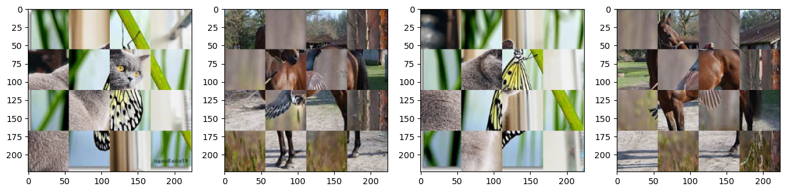

## 소개   
Cutout과 Cutmix는 Augmentation을 적용할 이미지의 일부를 랜덤하게 선택하기 때문에 최악의 경우 데이터에 타겟이 없을 수 있습니다.  
이 저장소는 이를 해결하기 위해 Gridmask와 Cutmix를 혼합한 grid cut mix 기법을 구현하여 실험한 내용을 담고 있습니다.   

## 개요   
Grid Cutmix는 두 개의 이미지를 그리드 영역으로 나눠준 뒤, 섞어줍니다.  
이를 통해, 기존 cutmix의 문제였던 타겟이 완전히 사라지는 경우를 줄일 수 있다 기대합니다.  
v4의 경우 grid영역을 랜덤하게 섞으며 가져온 그리드 영역의 수만큼 라벨을 분배합니다.  
v5의 경우 grid영역을 균일하게 섞으며 라벨을 0.5:0.5로 분배합니다.   
## 예시
cutmix  
   
grid_cutmix_v4 grid28  
  
grid_cutmix_v4 grid56  
  
grid_cutmix_v5  
  

## 실험
실험에 사용된 데이터셋은 캐글의 Animals-10을 사용하였습니다.  
(https://www.kaggle.com/datasets/alessiocorrado99/animals10)

Resnet 실험 결과  
  
CNN 계열의 Resnet 모델을 사용했으며, timm의 resnet18을 사용했습니다.  
전반적으로 CNN 모델에서 grid_cutmix의 성능은 cutmix보다 낮음을 알 수 있었습니다.  
또한, grid_cutmix의 성능을 높이기 위해서는 낮은 grid보다는 높은 grid로 갈수록 학습 성능이 좋다는 것을 알 수 있었습니다.  
현재 실험 환경의 한계로 224*224 input 이미지를 사용하였고, 그에 따라 grid를 56까지 실험했으나, 더 큰 모델과 높은 해상도를 사용한다면 높은 grid를 통해 더 나은 성능 개선을 기대합니다.

ViT 실험 결과  
  
Transformer 계열의 ViT 모델을 사용하였으며, timm의 vit-tiny-patch16 모델을 사용했습니다.  
Transformer 계열의 경우, cutmix기법이 학습에 큰 영향을 끼치지 못하는 것을 확인했습니다. grid_cutmix의 경우, patch 사이즈의 절반인 grid 8을 적용했을때, 약간의 학습 성능gi 개선이 이루어지는 것을 확인했습니다.

자세한 실험 결과는 wandb의 링크를 통해서 확인할 수 있습니다.
(https://wandb.ai/zionia4758/grid%20cut%20mix)  

## 분석
receptive field가 큰 CNN 계열의 모델에서는 grid를 키우는 것이 학습에 더 큰 도움이 된다는 것을 확인했습니다. 그러나, 학습에 사용한 데이터처럼 해상도가 작은 데이터에 대해서는 grid의 크기를 키우는 데 한계가 있었습니다.  
결과적으로는, 데이터를 patch 크기로 잘라서 분석하는 transformer 계열에서 적절한 grid 크기를 사용하였을 경우 cutmix보다 안정적으로 학습한다는 것을 확인했습니다.  

## 라이센스
실험에 사용한 Animals-10의 라이센스에 따라 GPL 2 라이센스가 적용됩니다.